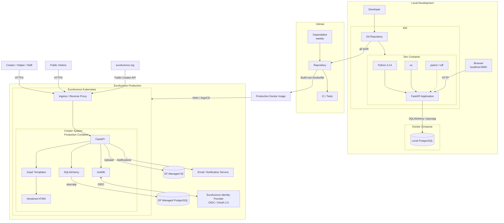

# Architecture

## Purpose

The Eurofurence Creator System manages Video Creator Badge applications,
creator profiles, helpers, badges, staff workflows, notifications, exports, and
the public creator gallery.

It will run at `creators.eurofurence.org` and become the source of truth for
Eurofurence creator data.

## Principles

* Keep the system simple, explicit, and maintainable.
* Use a modular monolith and server-side rendering.
* Keep business logic and authorization on the server.
* Prefer established libraries and existing project patterns.
* Avoid unnecessary services, abstractions, dependencies, and JavaScript.
* Keep public and internal data clearly separated.
* Treat uploads and other user input as untrusted.
* Keep development and production reproducible without sharing credentials.

## Application

The Creator System is one FastAPI application. HTTP routes call application and
domain logic, which uses SQLAlchemy to access PostgreSQL. Jinja2 renders HTML;
vendored HTMX may provide focused partial-page updates.

```text
Browser -> FastAPI route -> application/domain logic -> SQLAlchemy -> PostgreSQL
                         -> Jinja2 -> HTML
```

Routes should remain thin, templates should contain presentation rather than
business rules, and new layers should only be added when they solve a concrete
problem.

Code should be organized by functional area, such as authentication,
applications, creators, helpers, badges, gallery, and staff operations. The
exact package structure should follow actual implementation needs.

## Technology

| Area | Choice |
| --- | --- |
| Language | Python 3.14 |
| Web framework | FastAPI |
| Rendering | Jinja2 and vendored HTMX |
| Validation | Pydantic |
| Database | PostgreSQL |
| Persistence | SQLAlchemy 2.x and Alembic |
| PostgreSQL driver | psycopg |
| Authentication client | Authlib |
| Dependency management | `uv` with committed `uv.lock` |
| Tests and linting | pytest and Ruff |
| Production platform | Docker, Helm, ArgoCD, Eurofurence Kubernetes |

No SPA framework or Node.js frontend build system is planned.

## Domain Boundaries

| Area | Responsibility |
| --- | --- |
| Applications | Creator Badge application data and review workflow |
| Creator profiles | Public channel information and profile pictures |
| Helpers | Invitations and confirmation workflow |
| Badges | Persistent badge-number allocation and pickup |
| Staff | Review, search, management, exports, and badge pickup |
| Gallery | Public, event-specific creator information |

Application states are:

```text
NEW
ON_REVIEW
APPROVED
NOT_APPROVED
NOT_ACCEPTED
```

`NEW` is the initial state.

Helper states are:

```text
PENDING
CONFIRMED
DECLINED
```

A badge number is assigned when a creator is approved or a helper is confirmed.
Assigned badge numbers are persistent and are not reused because a later state
changes.

Gallery data is separated by event/year. Historical data is retained even when
it is no longer publicly visible.

## Data and Integrations

| Integration | Contract |
| --- | --- |
| PostgreSQL | Central Eurofurence-managed production database; local instances are for development and tests |
| Object storage | Eurofurence-managed S3-compatible storage for uploads; PostgreSQL stores references and metadata |
| Identity | Eurofurence Identity through OIDC/OAuth 2.0 |
| Notifications | Delivery mechanism remains open; Identity v2 documents a preview notification service |
| Public website | May consume a public, read-only Creator API |

The production deployment must not include its own PostgreSQL server. Uploaded
binary files must not be stored in PostgreSQL.

The public API is part of the main FastAPI application and exposes only data
intended for public display. Any future non-public machine API requires its own
least-privilege authentication and authorization design; it is not yet a fixed
requirement.

## Authentication and Authorization

Detailed provider findings are recorded in
[`AUTHENTICATION.md`](AUTHENTICATION.md). The live discovery document remains
authoritative for currently advertised endpoints and capabilities; the Identity
v2 documentation is an unreleased technical preview.

### Decided

* Use Eurofurence Identity through OIDC Authorization Code with PKCE `S256`.
* Use discovery-based Authlib configuration; do not implement OAuth or OIDC.
* Use the verified `sub` claim as the stable external user identifier.
* Keep identity, event registration, and Creator System permissions separate.
* Enforce all Creator System authorization on the server.
* Do not depend on v2-only behavior until its target environment is confirmed.

### Proposed

* Start with `openid profile email`; add `groups` only if group-based
  authorization is approved.
* Use a confidential web client and a server-side local application session.
* Keep provider tokens server-side and outside business logic.
* Initially omit `offline_access` unless a confirmed workflow needs refresh
  tokens.
* Support OIDC back-channel logout by associating verified `sid` values with
  local sessions.
* Use separate production and development OAuth clients.

### Open

* Whether implementation should target live v1 behavior or wait for v2.
* The endpoint, audience, token flow, and schema for current-user registration.
* The exact registration fields and values proving fully paid eligibility.
* When eligibility is checked again and how later changes are handled.
* Whether roles are local or Identity-group-derived, including any mapping.
* Approved scopes, callback URLs, logout URLs, localhost support, and client
  provisioning.
* Local session lifetime and whether local logout triggers provider-wide logout.

Authentication alone never grants a Creator System role.

## Configuration and Secrets

Environment configuration includes database, S3, OIDC, notification, and
application-secret settings.

Secrets must come from environment-specific secret management and must never be
committed, logged, baked into images, or exposed to development tooling.
Development defaults must not silently become production settings.

## Development and Deployment

The VS Code Dev Container and production image are separate:

* `.devcontainer/Dockerfile` provides the development environment.
* The root `Dockerfile` is the production image and should contain only runtime
  requirements.
* `uv` installs project dependencies from `pyproject.toml` and `uv.lock`.
* Docker Compose may provide local PostgreSQL and other supporting services.
* Normal development runs on localhost and must not require the production
  hostname or production credentials.

Production images are built from the root Dockerfile and deployed with Helm and
ArgoCD to Eurofurence Kubernetes. The application connects to centrally managed
PostgreSQL, S3, Identity, and notification infrastructure.

The exact production PostgreSQL version and deployment configuration are owned
by the Eurofurence infrastructure team.

## Delivery and Security

* Validate all input and uploads server-side.
* Enforce least privilege and authorization server-side.
* Never implement security protocols or cryptography manually.
* Never expose internal data through public endpoints.
* Use Alembic migrations for every schema change.
* Keep runtime and development dependencies separate where practical.
* Run pytest and Ruff in CI.
* Dependabot checks Python, Docker, and GitHub Actions dependencies weekly;
  updates still require review and CI.
* GitHub issues define implementation requirements and open questions.
* Coding agents must not silently resolve undecided product or architecture
  questions.

## Decision Status

The document uses these classifications:

* **FACT**: confirmed infrastructure or externally documented behavior.
* **DECIDED**: an established Creator System architecture decision.
* **PROPOSED**: a suitable direction that is not yet required.
* **OPEN**: requires a stakeholder or infrastructure decision.

Current open architecture questions are:

* Identity v1 versus v2 target and the registration/eligibility contract.
* Staff and administrator role assignment.
* Helper requirements, limits, and withdrawal behavior.
* Badge-number initialization and event/year behavior.
* Notification and email delivery.
* Audit logging.
* Public website API integration, caching, and fallback behavior.
* Badge print deadline and timezone.
* Production PostgreSQL version.
* Development OIDC client configuration.

Open questions must not become implementation assumptions.

## System Diagram


