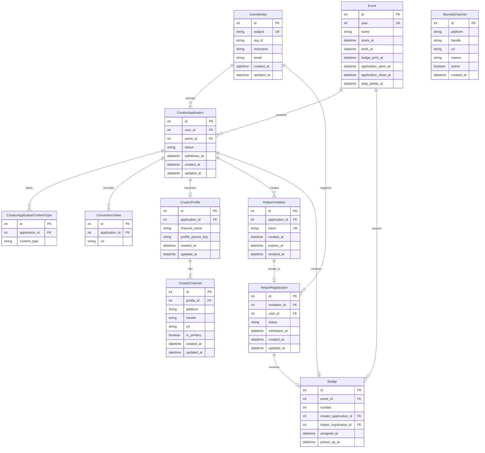

# Entity Relationship Model

```mermaid
erDiagram

%% Local representation of a person from the Eurofurence Identity Provider.
%% Event-related identity data is deleted as part of the event cleanup.
%% Probably needs to be changed later on: (Reg-ID, nickname, email)
UserIdentity {
    int id PK
    string subject UK
    string reg_id
    string nickname
    string email
    datetime created_at
    datetime updated_at
}


%% Represents a single Eurofurence event.
%% Event-related personal data must be deleted no later than data_delete_at.
%% The Event record itself may remain after cleanup because it does not contain creator/helper personal data.
Event {
    int id PK
    int year UK
    string name
    datetime starts_at
    datetime ends_at
    datetime badge_print_at
    datetime application_open_at
    datetime application_close_at
    datetime data_delete_at
}


%% An application submitted by a person for the current EF.
CreatorApplication {
    int id PK
    int user_id FK
    int event_id FK
    string status
    datetime withdrawn_at
    datetime created_at
    datetime updated_at
}


%% Multiple-choice selection of the planned content types for an application.
%% Expected values: LIVESTREAM, SHORTS, VLOGS.
CreatorApplicationContentType {
    int id PK
    int application_id FK
    string content_type
}


%% Existing convention videos submitted as part of an application.
ConventionVideo {
    int id PK
    int application_id FK
    string url
}


%% Public representation of an approved creator within the Eurofurence Creator System.
CreatorProfile {
    int id PK
    int application_id FK
    string channel_name
    string profile_picture_key
    datetime created_at
    datetime updated_at
}


%% An external publication channel belonging to a creator.
%% A CreatorProfile may have multiple channels. Exactly one channel per CreatorProfile should be marked as primary.
CreatorChannel {
    int id PK
    int profile_id FK
    string platform
    string handle
    string url
    boolean is_primary
    datetime created_at
    datetime updated_at
}


%% Invitation created by an approved creator for a helper.
HelperInvitation {
    int id PK
    int application_id FK
    string token UK
    datetime created_at
    datetime expires_at
    datetime revoked_at
}


%% Registration of a helper through an invitation.
%% Expected status values: PENDING, CONFIRMED, DECLINED.
HelperRegistration {
    int id PK
    int invitation_id FK
    int user_id FK
    string status
    datetime withdrawn_at
    datetime created_at
    datetime updated_at
}


%% Persistent badge number assigned to either a creator or a helper during the lifetime of an event.
%% Once assigned, a badge number must not be reused during that event. Badge records are deleted as part of the event data cleanup.
Badge {
    int id PK
    int event_id FK
    int number
    int creator_application_id FK
    int helper_registration_id FK
    datetime assigned_at
    datetime picked_up_at
}


%% Channels banned across multiple events.
%% BannedChannel records are retained across events and are excluded from the regular event data cleanup.
%% NEEDS CONFIRMATION: Long-term retention of banned channel data.
BannedChannel {
    int id PK
    string platform
    string handle
    string url
    string reason
    boolean active
    datetime created_at
}


UserIdentity ||--o{ CreatorApplication : submits

Event ||--o{ CreatorApplication : contains

CreatorApplication ||--o{ CreatorApplicationContentType : plans

CreatorApplication ||--o{ ConventionVideo : provides

CreatorApplication ||--o| CreatorProfile : becomes

CreatorProfile ||--|{ CreatorChannel : has

CreatorApplication ||--o{ HelperInvitation : creates

HelperInvitation ||--o| HelperRegistration : results_in

UserIdentity ||--o{ HelperRegistration : registers

Event ||--o{ Badge : assigns

CreatorApplication ||--o| Badge : receives

HelperRegistration ||--o| Badge : receives
```
